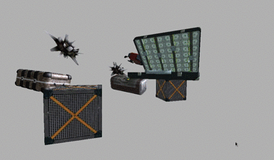

## Object Pick Selection Using Framebuffer and Picking Box
Pick selection (or mouse picking) is a way of selecting objects in 3D scene. It can be very useful for strategy games or any kind of 3D editors. There are different methods to achieve this. Most of them require ray casting (projecting 3D ray from mouse position, through the camera and into the scene) and converting mouse click position from viewport space to worldspace position. With ray origin position and direction vector it is possible to compute intersections with various primitive shapes (like spheres, AABB, OBB, triangles). Pick selection in this demo will use ray intersection with a sphere, AABB triangles, FBO color buffer and selection box. The full demo and source code is written in Java using libGDX and Intellij IDEA. Source code for pick selection in this repository can be quite easily converted to C++.

## Ray casting in libGDX
Fortunately the *Camera* class supplied with libGDX provides easy methods for getting picking ray parameters (origin and direction vectors). There are also methods for projecting given world space coordinates to screen coordinates (projecting point in 3D space onto the final 2D screen).

```java
/** Creates a picking from the coordinates given in screen coordinates. It is assumed that the viewport spans the
 * whole screen. The screen coordinates origin is assumed to be in the top left corner, its y-axis pointing down, the x-axis
 * pointing to the right. The returned instance is not a new instance but an internal member only accessible via this function.
 * @param viewportX the coordinate of the bottom left corner of the viewport in glViewport coordinates.
 * @param viewportY the coordinate of the bottom left corner of the viewport in glViewport coordinates.
 * @param viewportWidth the width of the viewport in pixels
 * @param viewportHeight the height of the viewport in pixels
 * @return the picking Ray. */
public Ray getPickRay (float screenX, float screenY, float viewportX, float viewportY, float viewportWidth, float viewportHeight) {
    unproject(ray.origin.set(screenX, screenY, 0), viewportX, viewportY, viewportWidth, viewportHeight);
    unproject(ray.direction.set(screenX, screenY, 1), viewportX, viewportY, viewportWidth, viewportHeight);
    ray.direction.sub(ray.origin).nor();
    return ray;
}
```

Unprojecting is done a little bit differently – it won't be that accurate, screen coordinates will be translated into world space where z-coordinate of 1.0 will return a point on the far plane of the camera frustum and a z-coordinate of 0.0 will return a point on the near plane.

```java
/** Function to translate a point given in screen coordinates to world space. It's the same as GLU gluUnProject, but does not
 * rely on OpenGL. The x- and y-coordinate of vec are assumed to be in screen coordinates (origin is the top left corner, y
 * pointing down, x pointing to the right) as reported by the touch methods in {@link Input}. A z-coordinate of 0 will return a
 * point on the near plane, a z-coordinate of 1 will return a point on the far plane. This method allows you to specify the
 * viewport position and dimensions in the coordinate system expected by {@link GL20#glViewport(int, int, int, int)}, with the
 * origin in the bottom left corner of the screen.
 * @param screenCoords the point in screen coordinates (origin top left)
 * @param viewportX the coordinate of the bottom left corner of the viewport in glViewport coordinates.
 * @param viewportY the coordinate of the bottom left corner of the viewport in glViewport coordinates.
 * @param viewportWidth the width of the viewport in pixels
 * @param viewportHeight the height of the viewport in pixels
 * @return the mutated and unprojected screenCoords {@link Vector3} */
public Vector3 unproject (Vector3 screenCoords, float viewportX, float viewportY, float viewportWidth, float viewportHeight) {
    float x = screenCoords.x, y = screenCoords.y;
    x = x - viewportX;
    y = Gdx.graphics.getHeight() - y - 1;
    y = y - viewportY;
    screenCoords.x = (2 * x) / viewportWidth - 1;
    screenCoords.y = (2 * y) / viewportHeight - 1;
    screenCoords.z = 2 * screenCoords.z - 1;
    screenCoords.prj(invProjectionView);
    return screenCoords;
}
```

If someone wants to convert the source code presented in this demo to C++, it will be quite easy to use OpenGL Mathematics library (https://glm.g-truc.net/) which supplies functions for complex matrix transformations including functions like project and unproject.

## Different methods for pick selection

### Picking ray intersection with sphere

This is one of the easiest methods for selecting objects in a 3D scene. It requires central position of each object and a radius of the bounding sphere. This method won't be very accurate if some of the objects are large and have irregular shape. Furthermore, bounding spheres can overlap on each other on the screen which will cause multiple or wrong selections. This can be avoided by additional checks for objects that are closer to the camera (although not implemented in this demo).


### Picking ray intersection with Axis-Aligned Bounding Box

This method can be sometimes even less accurate when compared to intersection with spheres. LibGDX provides ready to use static functions in class `Intersector` for checking whether or not the picking ray is intersecting with axis-aligned bounding box.


### Picking ray intersection with transformed AABB triangles (Oriented Bounding Box triangles)

This method is more accurate then the previous two, however it requires more processing power. More operations need to performed not only for transforming all 8 corner points of model's bounding box, but also for checking ray intersections with each one of 12 triangles that make the oriented bounding box of the current object model. Because of the way the bounding sphere radius is being calculated, it is certain that OBB will be always completely inside the sphere.

```java
if (status && isCheckOBBTriangles()) {
    // get bounding box of the model in model space!
    BoundingBox boundingBox = spatialObject.getOriginalBoundingBox();
    boundingBox.getCorner000(aabbPoints[0]);
    boundingBox.getCorner001(aabbPoints[1]);
    boundingBox.getCorner010(aabbPoints[2]);
    boundingBox.getCorner011(aabbPoints[3]);
    boundingBox.getCorner100(aabbPoints[4]);
    boundingBox.getCorner101(aabbPoints[5]);
    boundingBox.getCorner110(aabbPoints[6]);
    boundingBox.getCorner111(aabbPoints[7]);
    for (int i = 0; i < 8; i++) {
        aabbPoints[i].mul(spatialObject.getTransform());
    }
    hasCornerPoints = true; // for further use if needed
    // 12 triangles of the aabb
    for (int i = 0; i < 12; i++) {
        triangleStatus = Intersector.intersectRayTriangle(this.ray,
                aabbPoints[aabbTrisIdx[i][0] - 1],
                aabbPoints[aabbTrisIdx[i][1] - 1],
                aabbPoints[aabbTrisIdx[i][2] - 1],
                tmpVec);
        if (triangleStatus) {
            pickingInfo.result = Result.PICKED_OBB_TRIANGLES;
            pickingInfo.intersection.set(tmpVec);
            break;
        }
    } // for each triangle in the aabb
}
```


### Picking ray intersection with triangles of the convex mesh

Another way for selecting 3D objects is to use separate convex meshes for each object. These would need to be prepared and loaded externally. This method requires additional work to prepare convex meshes in 3D modeling software. The advantage is that such meshes could be used also with occlusion culling procedures (if correctly prepared). This way is not implemented here.

### Mouse pointer intersection with the on-screen rectangle

This method similarly to checking OBBs requires transforming all 8 corner points of the model's bounding box. Additionally each point after multiplication by the transformation matrix needs to be projected onto the screen (converting world space coordinates to screen space coordinates). Using on-screen rectangles for each object makes more sense when using it with picking/selection box.

```java
internalAABB.inf();
BoundingBox boundingBox = spatialObject.getOriginalBoundingBox();
if(!hasCornerPoints) {
    boundingBox.getCorner000(aabbPoints[0]);
    boundingBox.getCorner001(aabbPoints[1]);
    boundingBox.getCorner010(aabbPoints[2]);
    boundingBox.getCorner011(aabbPoints[3]);
    boundingBox.getCorner100(aabbPoints[4]);
    boundingBox.getCorner101(aabbPoints[5]);
    boundingBox.getCorner110(aabbPoints[6]);
    boundingBox.getCorner111(aabbPoints[7]);
    for (int i = 0; i < 8; i++) {
        aabbPoints[i].mul(spatialObject.getTransform());
        camera.project(aabbPoints[i]);
        internalAABB.ext(aabbPoints[i].x,
            aabbPoints[i].y,
            aabbPoints[i].z);
    }
} else {
    // already have updated aabbPoints - check aabb triangles is true
    for (int i = 0; i < 8; i++) {
        camera.project(aabbPoints[i]);
        internalAABB.ext(aabbPoints[i].x,
                aabbPoints[i].y,
                aabbPoints[i].z);
    }
}
internalAABB.getCenter(tmpVec);
pickingInfo.center.x = (int) tmpVec.x;
pickingInfo.center.y = (int) tmpVec.y;

pickingInfo.onScreen.x = internalAABB.min.x;
pickingInfo.onScreen.y = internalAABB.min.y;
pickingInfo.onScreen.width = internalAABB.getWidth();
pickingInfo.onScreen.height = internalAABB.getHeight();
```


### Using framebuffer and checking pixel data of the color texture

This method is the most accurate - it uses additional framebuffer object and texture. Extra rendering is done using a custom fragment shader - the scene needs to be rendered twice. Next, the pixel data needs to be read to CPU side buffer - this can be optimized by loading only pixels covered by the selection box (or just one pixel for comparison if selection is done by a single point click). Further optimization can be done by checking pixels covered only by the intersection of the main selection box with the on-screen rectangle of the given object.




## Definition of the *SpatialObject* interface

The *SpatialObject* interface will be used with the scene manager and the pick selection class. It provides functions for getting and setting spatial parameters like scale, transform, radius, position and so on. In order to work properly, the pick selection class needs the position, radius and bounding box dimensions of every visible object in the scene. The full list of spatial objects will be traversed when needed and each object will be queried.

```java
public interface SpatialObject {
    int getSpatialObjectID();

    BoundingBox getBoundingBox();
    BoundingBox getOriginalBoundingBox();

    boolean isVisible();

    Vector3 getExtent();
    Vector3 getCenter();
    float getRadius();

    Matrix4 getTransform();

    void setPosition(Vector3 position);
    void setPosition(float x, float y, float z);
    Vector3 getPosition();

    void setScale(float scale);
    void setScale(float x, float y, float z);
    Vector3 getScale();
}
```

## Overview of the *SimpleSceneManager* class

Scene manager class used in this demo provides just basic functions that are needed in 3D application. Hierarchy of scene nodes in 3D space is not used in this example (like octree or BVH). Just linear traversal of the game objects will be sufficient, as the number of all objects will be quite low.  Additional class `GameObject` extending `ModelInstance` and implementing `SpatialObject` interface is used. A game object class also has additional member variables for bounding box, object name, scale and so on. The scene manager also provides functionality to draw debug shapes for each game object using the `ShapeRenderer`, like AABBs and bounding spheres.


Frustum culling is implemented in an easiest possible way and is required for the pick selection to work properly. LibGDX `Camera` class already provides functions for checking whether or not primitive shapes are inside of the viewing frustum. Valid position and bounding sphere radius of each object is required.

```java
public boolean checkVisibilitySphere(GameObject gameObject) {
    return this.camera.frustum.sphereInFrustum(gameObject.center, gameObject.radius);
}

public boolean checkVisibilityBox(GameObject gameObject) {
    return this.camera.frustum.boundsInFrustum(gameObject.center, gameObject.dimensions);
}
```

### *AbstractFlags* class definition

The scene manager class also uses special `AbstractFlags` class for enums and on/off options. It is much easier to use such flags in similar way like in C++ and it doesn't require to have separate boolean variables for each option.

```java
public abstract class AbstractFlags {

    protected int value = 0;

    public AbstractFlags() {
    }

    public AbstractFlags(int value) {
        this.value = value;
    }

    public abstract int count();

    public abstract int[] getValues();

    public int getValue() {
        return this.value;
    }

    public void set(int _id, boolean toggle) {
        this.value |= _id;
        if (!toggle) {
            this.value ^= _id;
        }
    }

    public void unset(int _id) {
        this.value |= _id;
        this.value ^= _id;
    }

    public void reset() {
        value = 0;
    }

    public boolean isToggled(int _id) {
        return ((this.value & _id) == _id);
    }

    @Override
    public boolean equals(Object obj) {
        if (obj == null)
            return false;
        if (obj == this)
            return true;
        if (obj.getClass() != this.getClass())
            return false;
        AbstractFlags other = (AbstractFlags) obj;
        if (other.getValue() != this.getValue())
            return false;
        return true;
    }

    public void toArray(Array<Integer> result) {
        result.clear();
        final int length = this.count();
        int[] values = this.getValues();
        for (int i = 0; i < length; i++) {
            if (this.isToggled(values[i]))
                result.add(Integer.valueOf(values[i]));
        }
    }
}
```

Abstract flags used with the scene manager are extended to contain options for frustum culling and drawing debug shapes.

### *GameObject* class definition

The game object class extends directly `ModelInstance` class - this way it can be used directly with `ModelBatch` for quick and easy rendering. `GameObject` class also contains additional variables for storing original bounding box (aabb of the model), center position, extent vector, radius, scale and other useful data. All these are needed for frustum culling and pick selection to work. Additionally the `GameObject` implements the `SpatialObject` interface so it can be easily used with the `PickSelection` traverse functions.

```java
public class GameObject extends ModelInstance implements SpatialObject {
        
    public static final class StateFlags extends AbstractFlags {
        public static final int NO_FLAGS = 0;
        public static final int VISIBLE = 1;
        public static final int ACTIVE = 2;
        public static final int SELECTED = 4;

        public static final int[] values = {NO_FLAGS, VISIBLE, ACTIVE, SELECTED};

        public StateFlags() {
        }

        public StateFlags(int value) {
            super(value);
        }

        @Override
        public int count() {
            return values.length;
        }

        @Override
        public int[] getValues() {
            return values;
        }

    }

    protected BoundingBox boundingBox = new BoundingBox();
    protected BoundingBox originalBoundingBox = new BoundingBox();
    protected Vector3 center = new Vector3();
    protected Vector3 extent = new Vector3();
    protected Vector3 dimensions = new Vector3();
    protected Vector3 scale = new Vector3(1.0f, 1.0f, 1.0f);
    protected Vector3 tmpVec = new Vector3();
    protected Quaternion tmpQuat = new Quaternion();
    protected float radius = 0.0f;
    private int selfID = 0;
    private int parentID = 0;
    private String name = "";
    private StateFlags stateFlags = new StateFlags();
    protected boolean isTransformed = false;

    public GameObject(Model model) {
        super(model);
        refreshOriginalBoundingBox();
    }

    public GameObject(String name, Model model) {
        this(model);
        this.setName(name);
    }

    public GameObject(Model model, String rootNode, boolean mergeTransform) {
        super(model, rootNode, mergeTransform);
        refreshOriginalBoundingBox();
    }

    public GameObject(String name, Model model, String rootNode, boolean mergeTransform) {
        this(model, rootNode, mergeTransform);
        this.setName(name);
    }
}
```

Bounding box and sphere radius needs to be kept up to date and store valid data even when scaling is applied to the transformation matrix.

## Overview of the *PickSelection* class

### List of on/off options for pick selection

`AbstractFlags` class is extended inside of `PickSelection` class to provide various on/off options for customizing class behavior and for saving inner state values. Most of those options change the way the list of spatial objects is being traversed when needed and how each object is checked for ray intersections.

* `SELECTION_ON_CLICK` – selection works only when picker is active,
* `SELECTION_ON_HOVER` – selections is active even without toggled click,
* `CHECK_AABBS` – whether or not to check axis-aligned bounding boxes of each spatial object,
* `CHECK_ON_SCREEN_BOXES` – whether or not to test on-screen boxes; the spatial object's AABB is transformed and projected onto the screen,
* `CHECK_OBB_TRIANGLES` – whether or not to check ray intersections with triangles of an OBB – sometimes may be more accurate than checking bounding spheres (default),
* `CHECK_FBO_PIXELS` – whether or not to check the frame buffer pixel data (which is provided externally),
* `PICKER_ACTIVE` – whether or not the picker is active (is selection activated?),
* `GROUP_SELECTION_MODE` – used for activating multi-selection mode,
* `TOGGLE_SELECTION_MODE` – special mode where the second click (second selection) deselects the spatial object,
* `USE_PICKING_BOX` – whether or not to use the on-screen picking box for selecting multiple objects,
* `INTERNAL_BEGIN` – internal flag marking begin() function execution – set to false on end(),
* `INTERNAL_SHOULD_UNSELECT` – internal flag for force removing selected objects (when picking ray does not collide),
* `INTERNAL_SHOULD_CONTINUE` – internal flag telling whether or not the traversal should continue.

Some of those options exclude each other (like for example `SELECTION_ON_CLICK` and `SELECTION_ON_HOVER`), and others can be active simultaneously.

### Definition of the *PixelChecker* interface

This is a special interface used for checking pixels of the color texture that was rendered off-screen using the framebuffer. Each color value of the pixel (RGBA) can be converted to single 32 bit integer value that represents index of the rendered object (if any). This will help determine which object is under the mouse pointer. Such framebuffer and rendering procedures need to be handled outside of the `PickSelection` class and traverse methods, but in exchange this interface is provided. If available it is used alongside the code that checks for ray intersections.

```java
public interface PixelChecker {
    boolean isColorInPixels(int colorValue, Rectangle area);
}
```

### Inner *PickingInfo* class definition

This is a helper class used for storing extended information about given spatial object. This information includes intersection point (if any), the dimensions of the on-screen rectangle (not always available), picking result, timestamp and others. The class implements the `Poolable` interface for better memory management (meaning that new objects and taken from the existing object pool if available).

```java
static public final class PickingInfo implements Pool.Poolable {
    /* Spatial object being check */
    public SpatialObject spatialObject = null;
    /* Current pick selection result for given object */
    public Result result = Result.NOT_PICKED;
    /* Intersection point (ray with 3D sphere) */
    public Vector3 intersection = new Vector3();
    /* On screen rectangle occupied by the object */
    public Rectangle onScreen = new Rectangle();
    /* radius of the 2D onscreen circle */
    public int radius = 0;
    /* Center of the bound 2d circle */
    public Vector2i center = new Vector2i();
    /* timestamp in milliseconds - when the object was selected */
    public float timeStamp = 0;
    /* whether or not is currently selected */
    public boolean selected = false;
    /* whether or not the picking box contains the on-screen box of this object */
    public boolean pickBoxContains = false;
    /* whether or not the picking box overlaps with the on-screen box */
    public boolean pickBoxOverlaps = false;

    @Override
    public void reset() {
        spatialObject = null;
        result = Result.NOT_PICKED;
        intersection.set(0.0f, 0.0f, 0.0f);
        onScreen.set(0, 0, 0, 0);
        radius = 0;
        center.set(0, 0);
        timeStamp = 0.0f;
        selected = false;
        pickBoxContains = false;
        pickBoxOverlaps = false;
    } 
}
```

### Definition of the *OnSelectionListener* interface

There's an easy way to provide multiple listeners for handling object selections on the fly. Those listeners won't always be called in bulk (when deselecting all objects at once).

```java
public interface OnSelectionListener {
    void selectionChanged(SpatialObject spatialObject, PickingInfo pickingInfo, boolean selected);
}

Array<OnSelectionListener> onSelectionListenersArray = new Array<OnSelectionListener>();

public boolean addOnSelectionListener(OnSelectionListener onSelectionListener) {
    if (onSelectionListenersArray.contains(onSelectionListener, true)) {
        return false;
    }
    onSelectionListenersArray.add(onSelectionListener);
    return true;
}

public boolean removeOnSelectionListener(OnSelectionListener onSelectionListener) {
    return onSelectionListenersArray.removeValue(onSelectionListener, true);
}

public Array<OnSelectionListener> getOnSelectionListenersArray() {
    return onSelectionListenersArray;
}

protected void callOnSelectionListeners(SpatialObject spatialObject,
                                        PickingInfo pickingInfo,
                                        boolean selected) {
    for (int i = 0; i < onSelectionListenersArray.size; i++) {
        OnSelectionListener onSelectionListener = onSelectionListenersArray.get(i);
        onSelectionListener.selectionChanged(spatialObject,
                pickingInfo,
                selected);
    } 
}
```

### Definition of *internal_isPicked(PickingInfo)* function

In this function ray intersections are checked with chosen spatial object and the `PickingInfo` object is updated depending on the tests results. Here is also where the point transformations are performed and corner points of the bounding box are projected onto the screen, so this function can be quite time consuming (and it should not be called multiple times in a row for the same spatial object). The test result is later used in `performFullCheck(...)` function to finally determine whether or not given spatial object is selected (which also depends on current selection mode and not only on ray intersection).

```java
protected Result internal_isPicked(PickingInfo pickingInfo) {
    SpatialObject spatialObject = pickingInfo.spatialObject;
    pickingInfo.result = Result.NOT_PICKED;
    boolean status = Intersector.intersectRaySphere(this.ray,
            spatialObject.getCenter(),
            spatialObject.getRadius(),
            pickingInfo.intersection), triangleStatus, hasCornerPoints = false;

    if (status && !isCheckOBBTriangles())
        pickingInfo.result = Result.PICKED_SPHERE;

    if(isCheckAABBs()) {
        if(Intersector.intersectRayBoundsFast(this.ray,
                spatialObject.getCenter(),
                spatialObject.getDimensions())) {
            // intersected with AABB (not OBB)
            pickingInfo.result = Result.PICKED_AABB;
        }
    }

    if (status && isCheckOBBTriangles()) {
        // get bounding box of the model in model space!
        BoundingBox boundingBox = spatialObject.getOriginalBoundingBox();
        boundingBox.getCorner000(aabbPoints[0]);
        boundingBox.getCorner001(aabbPoints[1]);
        boundingBox.getCorner010(aabbPoints[2]);
        boundingBox.getCorner011(aabbPoints[3]);
        boundingBox.getCorner100(aabbPoints[4]);
        boundingBox.getCorner101(aabbPoints[5]);
        boundingBox.getCorner110(aabbPoints[6]);
        boundingBox.getCorner111(aabbPoints[7]);
        for (int i = 0; i < 8; i++) {
            aabbPoints[i].mul(spatialObject.getTransform());
        } // for each aabb point
        hasCornerPoints = true; // for further use if needed
        // 12 triangles of the aabb
        for (int i = 0; i < 12; i++) {
            triangleStatus = Intersector.intersectRayTriangle(this.ray,
                    aabbPoints[aabbTrisIdx[i][0] - 1],
                    aabbPoints[aabbTrisIdx[i][1] - 1],
                    aabbPoints[aabbTrisIdx[i][2] - 1],
                    tmpVec);
            if (triangleStatus) {
                pickingInfo.result = Result.PICKED_OBB_TRIANGLES;
                pickingInfo.intersection.set(tmpVec);
                break;
            }
        } // for each triangle in the aabb
    }

    tmpRectangle.x = pickPos.x;
    tmpRectangle.y = pickPos.y;
    tmpRectangle.width = 1.0f;
    tmpRectangle.height = 1.0f;

    if (isOnClick() && isUsePickingBox() || isCheckOnScreenBoxes()) {
        internalAABB.inf();
        BoundingBox boundingBox = spatialObject.getOriginalBoundingBox();
        if(!hasCornerPoints) {
            boundingBox.getCorner000(aabbPoints[0]);
            boundingBox.getCorner001(aabbPoints[1]);
            boundingBox.getCorner010(aabbPoints[2]);
            boundingBox.getCorner011(aabbPoints[3]);
            boundingBox.getCorner100(aabbPoints[4]);
            boundingBox.getCorner101(aabbPoints[5]);
            boundingBox.getCorner110(aabbPoints[6]);
            boundingBox.getCorner111(aabbPoints[7]);
            for (int i = 0; i < 8; i++) {
                aabbPoints[i].mul(spatialObject.getTransform());
                camera.project(aabbPoints[i]);
                internalAABB.ext(aabbPoints[i].x,
                        aabbPoints[i].y,
                        aabbPoints[i].z);
            }
        } else {
            // already have updated aabbPoints - check aabb triangles is true
            for (int i = 0; i < 8; i++) {
                camera.project(aabbPoints[i]);
                internalAABB.ext(aabbPoints[i].x,
                        aabbPoints[i].y,
                        aabbPoints[i].z);
            }
        }
        internalAABB.getCenter(tmpVec);
        pickingInfo.center.x = (int) tmpVec.x;
        pickingInfo.center.y = (int) tmpVec.y;

        pickingInfo.onScreen.x = internalAABB.min.x;
        pickingInfo.onScreen.y = internalAABB.min.y;
        pickingInfo.onScreen.width = internalAABB.getWidth();
        pickingInfo.onScreen.height = internalAABB.getHeight();
        if(isUsePickingBox()) {
            pickingInfo.pickBoxOverlaps = pickBox.overlaps(pickingInfo.onScreen);
            pickingInfo.pickBoxContains = pickBox.contains(pickingInfo.onScreen);
            boolean boxStatus = pickingInfo.pickBoxOverlaps || pickingInfo.pickBoxContains;
            if (boxStatus && !isCheckFBOPixels()) {
                pickingInfo.result = goodPickResult; // force proper selection result
            } else if (boxStatus && fboPixelChecker != null) {
                int colorValue = pickingInfo.spatialObject.getSpatialObjectID();
                Intersector.intersectRectangles(pickBox,
                        pickingInfo.onScreen,
                        tmpRectangle);
                // This function gets now intersection rectangle (needs to detect it)
                if (fboPixelChecker.isColorInPixels(colorValue, tmpRectangle, false)) {
                    pickingInfo.result = goodPickResult;
                }
            } // has fbo pixel checker?
        } else {
            // check on screen boxes
            // tmp rectangle is one pixel in size
            pickingInfo.pickBoxContains = false;
            pickingInfo.pickBoxOverlaps = false;
            boolean boxStatus = pickingInfo.onScreen.overlaps(tmpRectangle) || pickingInfo.onScreen.contains(tmpRectangle);
            if(boxStatus && !isCheckFBOPixels()) {
                pickingInfo.result = Result.PICKED_ON_SCREEN_BOX;
            } else if(boxStatus && fboPixelChecker != null) {
                int colorValue = pickingInfo.spatialObject.getSpatialObjectID();
                if (fboPixelChecker.isColorInPixels(colorValue, tmpRectangle, false)) {
                    pickingInfo.result = goodPickResult;
                }
            }
        }
    } else if (!isUsePickingBox() && isCheckFBOPixels() && fboPixelChecker != null) {
        int colorValue = pickingInfo.spatialObject.getSpatialObjectID();
        if (fboPixelChecker.isColorInPixels(colorValue, tmpRectangle, false)) {
            pickingInfo.result = goodPickResult;
        }
    }
    return pickingInfo.result;
}
```

### Definition of *performFullCheck(SpatialObject)* function

This function is called from the main `traverse()` function. It determines whether or not to mark given spatial object as selected and add it to the list.

```java
public PickingInfo performFullCheck(SpatialObject spatialObject) {
    final Integer key = spatialObject.getSpatialObjectID();
    PickingInfo pickingInfo = pickingInfoMap.get(key);
    if (pickingInfo == null) {
        pickingInfo = pickingInfoPool.obtain();
        pickingInfo.spatialObject = spatialObject;
        pickingInfoMap.put(key, pickingInfo);
    } else if (pickingInfo.spatialObject == null) {
        pickingInfo.spatialObject = spatialObject;
    }
    pickingInfo.result = this.internal_isPicked(pickingInfo);
    boolean shouldRemove = false;
    boolean shouldAdd = false;
    final int index = selectedObjects.indexOf(spatialObject, true); // obj1 == obj2
    final float ts = pickingInfo.timeStamp;
    final float exact = ((float) TimeUtils.timeSinceMillis(initTimeStamp)) / 1000.0f;
    if (pickingInfo.result == goodPickResult) {
        if (isToggleSelectionMode() && isPickerActive() && !isOnHover() && ts < pickTimeStampBegin) {
            pickingInfo.selected = !pickingInfo.selected;
            if (!pickingInfo.selected) {
                shouldRemove = true;
            } else {
                shouldAdd = true;
            }
        } else if (pickingInfo.selected) {
            shouldAdd = false;
            // no toggle mode - already selected, no event
        } else if (!isToggleSelectionMode() || isOnHover()) {
            // not toggle selection mode
            // not checking for picker status
            pickingInfo.selected = true;
            shouldAdd = true;
        }

        if (!isGroupSelectionMode()) {
            // first selected wins! ignore the rest
            // this works only with traverse() functions
            shouldContinue(false);
        }

        if ((isOnHover() || !isGroupSelectionMode()) && shouldAdd) {
            // no grouping
            for (int i = 0; i < selectedObjects.size; i++) {
                SpatialObject selectedSpatialObject = selectedObjects.get(i);
                int selectedSpatialObjectID = selectedSpatialObject.getSpatialObjectID();
                PickingInfo selectedPickingInfo = pickingInfoMap.get(Integer.valueOf(selectedSpatialObjectID));
                if (selectedPickingInfo != null)
                    selectedPickingInfo.selected = false;
            }
            selectedObjects.clear();
            selectedObjects.add(spatialObject);
            pickingInfo.timeStamp = exact;
            pickingInfo.selected = true;
        }

        if (isGroupSelectionMode() && !isOnHover() && shouldAdd) {
            if (!selectedObjects.contains(spatialObject, true)) {
                selectedObjects.add(spatialObject);
                pickingInfo.timeStamp = exact;
            }
        }
    } else if (shouldUnselect()) {
        shouldRemove = true;
        pickingInfo.selected = false;
    }
    if (shouldRemove && selectedObjects.size > 0 && index >= 0) {
        selectedObjects.removeIndex(index);
        pickingInfo.selected = false;
        pickingInfo.timeStamp = exact;
    }
    return pickingInfo;
}
```

### Definition of *begin()* function

This function is used for setting internal flags to proper values. Depending on the list of active options, different internal flags are toggled – for example when single-selection mode is active, all spatial objects that do not collide with picking ray are marked as not selected and removed from the list (this won't be necessary in multi-selection mode). Inside this function it is also determined what is considered a good pick result (ray colliding with an AABB? or OBB? and so on) and this value is later used in traversal functions. Selection box parameters like position and dimensions also need refreshing - rectangle used for drawing uses bottom left corner as origin, just like the drawing methods provided with libGDX, however input event reporting uses the top left corner as the origin (this coordinates are fixed in picker position update function).

```java
public boolean begin() {
    if (stateFlags.isToggled(StateFlags.INTERNAL_BEGIN))
        return false;
    stateFlags.set(StateFlags.INTERNAL_BEGIN, true);
    shouldContinue(false);
    shouldUnselect(false);
    goodPickResult = Result.NOT_PICKED;
    refreshPickBoxDimensions();
    if (isOnClick()) {
        shouldContinue(isPickerActive());
        if ((!isToggleSelectionMode() && !isGroupSelectionMode()) ||
                (isUsePickingBox() && !isToggleSelectionMode())) {
            shouldUnselect(true);
        }
    } else if (isOnHover()) {
        shouldContinue(true);
        shouldUnselect(true);
    }

    if (shouldContinue()) {
        updateRay();
        goodPickResult = Result.PICKED_SPHERE;
        if(isCheckAABBs())
            goodPickResult = Result.PICKED_AABB;
        if(isCheckOnScreenBoxes())
            goodPickResult = Result.PICKED_ON_SCREEN_BOX;
        if (isCheckOBBTriangles())
            goodPickResult = Result.PICKED_OBB_TRIANGLES;
        if (isCheckFBOPixels())
            goodPickResult = Result.PICKED_PIXEL;
    }
    return true;
}
```

### Definition of *traverse()* function

This function (when called properly) checks all the objects for ray intersections and updates the list of selected objects - also this is where the on-selection listeners are being called. Custom traverse procedure can be used, however one would still need to use `begin()` and `end()` functions (they're required for the pick selection to work properly; `begin()` is the function where internal flags are set and checked).

```java
public boolean traverse(Array<SpatialObject> spatialObjectsArray,
                                boolean shouldCallListeners) {
    if (!begin())
        return false;
    if (!shouldContinue()) {
        end();
        return false;
    }
    final int numObjects = spatialObjectsArray.size;
    SpatialObject spatialObject;
    boolean wasSelectedBefore;
    for (int i = 0; i < numObjects; i++) {
        wasSelectedBefore = false;
        spatialObject = spatialObjectsArray.get(i);
        if (!spatialObject.isVisible())
            continue;
        final int objectID = spatialObject.getSpatialObjectID();
        PickingInfo pickingInfo;
        if (pickingInfoMap.containsKey(objectID)) {
            pickingInfo = pickingInfoMap.get(objectID);
            wasSelectedBefore = pickingInfo.selected;
        }
        pickingInfo = performFullCheck(spatialObject);
        if (pickingInfo.selected && shouldCallListeners && !wasSelectedBefore) {
            // SELECTED! NEW!
            callOnSelectionListeners(spatialObject, pickingInfo, true);
        } else if (!pickingInfo.selected && shouldCallListeners && wasSelectedBefore) {
            // UNSELECTED!
            callOnSelectionListeners(spatialObject, pickingInfo, false);
        }
        if (!shouldContinue()) {
            // already selected something - no multiple selection is allowed
            break;
        }
    }
    return end(); // should return true
}
```

## Using selection box with mouse picking

Selection box can be used for selecting multiple objects at once. It is drawn by holding the mouse button (or selection button) and dragging the selector pointer. Depending on what the final usage is, the selection box can be drawn as a 2D rectangle on the screen or as a 3D rectangle on the scene plane or complex terrain. This demo uses the 2D solution for the selection box. When using the selection box which is covering some area of the screen, there is no way to use picking rays to determine which objects are selected (well one could cast rays from every covered pixel, but that approach would be far from optimal). The solution is to project corner points of the transformed AABB (so in fact an oriented bounding box) onto the screen and calculate the optimal 2D rectangle box for each spatial object. Then it will be possible to determine whether or not the selection box does overlap or contain any of the spatial objects on-screen rectangles. Please mind that this approach won't be 100% accurate as sometimes the rectangles may be quite big and take more place than the 3D object on the screen. The animation below shows the accuracy of this method.


## Setting up the framebuffer object

The framebuffer in OpenGL is a collection of multiple buffers that can be used as target for rendering without disturbing the main screen. A framebuffer object needs to be created for the user-defined framebuffer to work. Framebuffer object can also contain various images attached to it, depending on the usage. Images bound with color-renderable formats need to be attached to `COLOR_ATTACHEMENT`. This is where the fragment shader will output colors. Texture object will contain this image (or multiple images) and will be easily accessible from shaders via various methods. This is how rendering picture in picture effects work and other complex post-processing effects.

First the framebuffer object needs to be created by calling `glGenFramebuffer()` function and bound to the current context by using `glBindFramebuffer()` function – the first parameter determines the target to which the framebuffer will be bound.

```java
frameBufferObject = Gdx.gl20.glGenFramebuffer();
Gdx.gl20.glBindFramebuffer(GL20.GL_FRAMEBUFFER, frameBufferObject);
```

Additional renderbuffer object needs to be created to store the depth information while rendering (this will allow to sort objects). Please note that textures or renderbuffer depth storage do not need to have the same size (resolution) as the screen/window. The framebuffer used for pick selection can be smaller to save memory and optimize speed – this will however cause the pick selection to be less accurate.

```java
renderBufferObject = Gdx.gl20.glGenRenderbuffer();
Gdx.gl20.glBindRenderbuffer(GL20.GL_RENDERBUFFER, renderBufferObject);
Gdx.gl20.glRenderbufferStorage(GL20.GL_RENDERBUFFER, GL20.GL_DEPTH_COMPONENT16, width, height);
Gdx.gl20.glBindRenderbuffer(GL20.GL_RENDERBUFFER, 0);

Gdx.gl20.glFramebufferRenderbuffer(GL20.GL_FRAMEBUFFER,
        GL20.GL_DEPTH_ATTACHMENT,
        GL20.GL_RENDERBUFFER,
        renderBufferObject);
```

The internal texture to hold the image needs to have internal format of RGBA/RGBA8888. When rendering objects off-screen the custom shader will write single color values for each fragment - which are in fact 32 bit integers converted to four RGBA float components clamped to range 0.0 – 1.0.

```java
height = (int) (screenHeight * (width / ((float) screenWidth)));

texture = new Texture(width, height, Pixmap.Format.RGBA8888);
texture.setFilter(Texture.TextureFilter.Nearest, Texture.TextureFilter.Nearest);
texture.setWrap(Texture.TextureWrap.ClampToEdge, Texture.TextureWrap.ClampToEdge);
texture.bind();

Gdx.gl20.glFramebufferTexture2D(GL20.GL_FRAMEBUFFER,
    GL20.GL_COLOR_ATTACHMENT0,
    GL20.GL_TEXTURE_2D,
    texture.getTextureObjectHandle(), 0);
```

As mentioned before, the color attachment texture and renderbuffer's depth storage don't need to have the same size as the screen. In this demo the default width is set to 256 pixels and height is proportional to the screen size.

## Writing to and reading from the framebuffer

Custom rendering code needs to be used to update the selected framebuffer internal data. Also the second rendering pass needs to be done, now using different shader that just writes through the selected color passed via uniform variable. No shading nor lighting techniques are required, the rendered objects need to be absolutely flat having just one color. This color can be later read and converted to single integer value. Fortunately, the libGDX framework and `Color` class provides static methods for such conversions which makes things quite easier.

```glsl
#ifdef GL_ES
precision mediump float;
#endif
uniform vec4 u_baseColor = vec4(0.0, 0.0, 0.0, 1.0);

void main()
{
    gl_FragColor = u_baseColor;
}
```

The additional class for rendering PickSelectionRenderer implemented for purposes of this demo won’t work with skinned meshes; The custom shader is also created using the `DefaultShader` object which contains one big shader with a lot of preprocessor conditions. When creating shader programs for use with the pick selection, the vertex shaders need to stay the same for given objects - only fragment shaders source code needs to be swapped.

```java
Renderable renderable = new Renderable();
renderable.environment = sceneManager.getEnvironment();
renderable.material = new Material();
renderable.meshPart.mesh = new Mesh(true, 4, 4, VertexAttribute.Position());

pickShader = new DefaultShader(renderable,
        new DefaultShader.Config() {
            {
                this.fragmentShader = fragmentShaderText;
            }
        });

pickShader.init();
```

The rendering code is based on the `ModelBatch` class functions - the code uses `Renderable` objects which contain all information needed to make a single draw call - they define what (the shape), how (the material) and where (the transform) should be rendered by which shader program.

```java
public void renderToFrameBuffer() {
    frameBuffer.bind();
    Gdx.gl.glClearColor(1.0f, 1.0f, 1.0f, 1.0f);
    Gdx.gl.glClear(GL20.GL_COLOR_BUFFER_BIT | GL20.GL_DEPTH_BUFFER_BIT);
    Gdx.gl.glViewport(0, 0, frameBuffer.width, frameBuffer.height);
    Gdx.gl.glDisable(GL20.GL_BLEND);
    Gdx.gl.glEnable(GL20.GL_DEPTH_TEST);
    Gdx.gl.glDepthMask(true);
    Array<GameObject> gameObjects = sceneManager.getGameObjects();
    pickShader.begin(sceneManager.getCamera(), sceneManager.getModelBatch().getRenderContext());

    // the rendering loop is based on the code from ModelBatch class
    for (int objectIndex = 0; objectIndex < gameObjects.size; objectIndex++) {
        final GameObject gameObject = gameObjects.get(objectIndex);
        if (!gameObject.isVisible())
            continue; // ignore not visible game objects
        int gameObjectIndex = 1 + gameObject.getID(); // up one!
        Color.rgba8888ToColor(pickingColor, gameObjectIndex);
        pickShader.program.setUniformf("u_baseColor",
                pickingColor.r,
                pickingColor.g,
                pickingColor.b,
                pickingColor.a);
        final int offset = renderableArray.size;
        gameObject.getRenderables(renderableArray, renderablesPool);
        for (int i = offset; i < renderableArray.size; i++) {
            Renderable renderable = renderableArray.get(i);
            renderable.environment = sceneManager.getEnvironment();
            renderable.shader = pickShader;
            pickShader.render(renderable);
        }
    }

    pickShader.end();
    renderablesPool.flush();
    renderableArray.clear();
    frameBuffer.unbind();

    Gdx.gl.glViewport(0, 0,
            sceneManager.getScreenWidth(),
            sceneManager.getScreenHeight());
}
```

The `PickSelectionRenderer` class has access to the current `PickSelection` object instance along with `PickSelectionFrameBuffer` - it’s done this way so the CPU side pixel buffer is updated more easily and in optimal way. There’s no need to always copy all the pixels of the color attachment texture – just the size determined by the picking box (selection rectangle, if any). If it’s a single click selection, then only 1×1 pixel area needs to be copied to buffer and compared.

```java
public void refreshPixelBuffer() {
    // Need to read just the selection box (or single pixel)
    Rectangle pickBox = pickSelection.getPickBox();
    Vector2i pickPos = pickSelection.getPickPosition();
    int x = pickPos.x, y = pickPos.y, w = 1, h = 1;
    if (pickSelection.isOnClick() && pickSelection.isUsePickingBox()) {
        x = (int) pickBox.x;
        y = (int) pickBox.y;
        w = (int) pickBox.width;
        h = (int) pickBox.height;

        w = frameBuffer.computePositionX(w);
        h = frameBuffer.computePositionX(h);
    }
    x = frameBuffer.computePositionX(x);
    y = frameBuffer.computePositionY(y);
    if (w == 0)
        w = 1;
    if (h == 0)
        h = 1;

    frameBuffer.refreshPixelBuffer(x, y, w, h);
}
```

The `PickSelectionRenderer` class implements the `PickSelection.PixelChecker` interface, so the `PickSelection` code can easily check the pixel data for a given object index (object color used to identify it).

```java
@Override
public boolean isColorInPixels(int colorValue, Rectangle area) {
    if (!frameBuffer.isValid())
        throw new RuntimeException("Pick selection buffer is not valid");
    boolean status = false;
    final Rectangle pickBox = pickSelection.getPickBox();
    int area_x = Math.max(frameBuffer.computePositionX((int) area.x - (int) pickBox.x), 0);
    int area_y = Math.max(frameBuffer.computePositionY((int) area.y - (int) pickBox.y), 0);
    int area_width = frameBuffer.computePositionX((int) area.width);
    int area_height = frameBuffer.computePositionY((int) area.height);
    int line_width = frameBuffer.computePositionX((int) pickBox.width);
    if (area_width == 0)
        area_width = 1;
    if (line_width == 0)
        line_width = 1;
    if (area_height == 0)
        area_height = 1;

    int red, green, blue, alpha;
    int gameObjectIndex, finalOffset;
    int pixelSize = frameBuffer.getPixelSize();
    int offset = area_x * pixelSize + area_y * pixelSize * line_width;
    for (int y = 0; y < area_height && !status; y++) {
        for (int x = 0; x < area_width && !status; x++) {
            finalOffset = offset + x * pixelSize + y * pixelSize * line_width;

            red = frameBuffer.bytePixels[finalOffset + 0];
            green = frameBuffer.bytePixels[finalOffset + 1];
            blue = frameBuffer.bytePixels[finalOffset + 2];
            alpha = frameBuffer.bytePixels[finalOffset + 3];
            gameObjectIndex = Color.toIntBits(alpha, blue, green, red);
            gameObjectIndex--; // down one
            if (gameObjectIndex == colorValue) {
                status = true;
                break;
            }
        }
    }
    return status;
}
```

## Picking objects using the FBO texture data

In order to gain access to data stored inside of the color attachment texture, selected range of pixels need to be transferred from GPU memory. Easy optimization is to read only pixels covered by the selection box (other pixels won’t get tested anyway). Below is the source code for the function refreshing the pixel byte buffer (implemented in `PickSelectionFrameBuffer` class).

```java
public void refreshPixelBuffer(int x, int y, int w, int h) {
    Gdx.gl20.glBindFramebuffer(GL20.GL_FRAMEBUFFER, frameBufferObject);
    Gdx.gl20.glPixelStorei(GL20.GL_PACK_ALIGNMENT, 4);
    if (x + w > width)
        w = width - x;
    if (y + h > height)
        h = height - y;
    int length = w * h * pixelSize;
    if (length > bytePixels.length)
        length = bytePixels.length; // protect against overflow (throw?)
    byteBuffer.position(0);
    Gdx.gl.glReadPixels(x, y, w, h,
            GL20.GL_RGBA, GL20.GL_UNSIGNED_BYTE, byteBuffer);
    byteBuffer.position(0);
    byteBuffer.get(bytePixels, 0, length);
    Gdx.gl20.glBindFramebuffer(GL20.GL_FRAMEBUFFER, 0);
}
```

In the end of the render frame, the pick selection framebuffer needs to be updated. It only needs to be done when the picker is active (no need to run additional off-screen rendering if the pixel data won’t be used anyway). Object diffuse colors can be updated when necessary.

```java
if (pickSelection.isPickerActive()) {
    pickSelection.refreshPickBoxDimensions();
    pickSelectionRenderer.renderToFrameBuffer();
    pickSelectionRenderer.refreshPixelBuffer();
    pickSelection.traverse(true);
    updateObjectsColors(pickSelection.getSelectedObjects());
}
```

